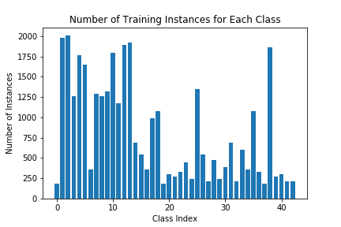
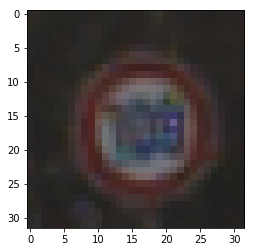
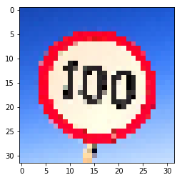

# Traffic Sign Classifier

## Data Set Summary & Exploration

### 1. Provide a basic summary of the data set. In the code, the analysis should be done using python, numpy and/or pandas methods rather than hardcoding results manually.

I used built-in python functions to calculate summary statistics of the traffic signs data set. To find the number of unique classes, I created a set (hashtable) from the list of labels and counted the number of elements in the set.

* The size of training set is 34799
* The size of the validation set is 4410
* The size of test set is 12630
* The shape of a traffic sign image is 32x32
* The number of unique classes/labels in the data set is 43

### 2. Include an exploratory visualization of the dataset.

Here is an exploratory visualization of the data set. It is a bar chart showing how many training instances are provided for each class. It appears that this dataset contains lots of examples of common signs (such as speed limit 30km/h) but only a few of the presumably uncommon signs (such as end of no passing).

## Design and Test a Model Architecture

### 1. Describe how you preprocessed the image data. What techniques were chosen and why did you choose these techniques? Consider including images showing the output of each preprocessing technique. Pre-processing refers to techniques such as converting to grayscale, normalization, etc.

I created two separate data preprocessing pipelines - one for training and one for evaluation. Both pipelines scale the pixel values to range from 0.0 to 1.0.

The training pipeline also performs basic data augmentation by padding the images with a 4-pixel border and randomly cropping this 40x40 image to 32x32.

I attempted to use horizontal flip augmentation, but this severely degraded performance. Naive implementation of flip augmentation makes it impossible for the net to discriminate between classes such as "turn right ahead" and "turn left ahead." It would still be possible to create additional training instances by flipping some of the signs, but this would need to be done on a class-by-class basis and some of the labels would also need to be changed.

### 2. Describe what your final model architecture looks like including model type, layers, layer sizes, connectivity, etc.) Consider including a diagram and/or table describing the final model.

I used the ResNet architecture described in "Deep Residual Learning for Image Recognition" and "Identity Mappings in Deep Residual Networks," both by Kaiming He et. al. This architecture is very flexible because the number of layers and number of channels in each layer can easily be adjusted. I used N=5 which corresponds to a total of 32 trainable layers. Each convolutional layer also includes batch normalization and ReLU activation. A skip connection is provided for each pair of trainable layers, except that there is an un-paired convolutional layer at the start and a classifying layer at the end.

| Layer         		 | Description                                   |
|:----------------------:|:---------------------------------------------:|
| Input         		 | 32x32x3 RGB image   							 |
| Convolution 3x3     	 | 1x1 stride, same padding, outputs 32x32x32	 |
| Convolution 3x3        | 1x1 stride, same padding, outputs 32x32x32    |
| Convolution 3x3        | 1x1 stride, same padding, outputs 32x32x32    |
| Convolution 3x3        | 1x1 stride, same padding, outputs 32x32x32    |
| Convolution 3x3        | 1x1 stride, same padding, outputs 32x32x32    |
| Convolution 3x3        | 1x1 stride, same padding, outputs 32x32x32    |
| Convolution 3x3        | 1x1 stride, same padding, outputs 32x32x32    |
| Convolution 3x3        | 1x1 stride, same padding, outputs 32x32x32    |
| Convolution 3x3        | 1x1 stride, same padding, outputs 32x32x32    |
| Convolution 3x3        | 1x1 stride, same padding, outputs 32x32x32    |
| Convolution 3x3        | 1x1 stride, same padding, outputs 32x32x32    |
| Convolution 3x3        | 2x2 stride, same padding, outputs 16x16x64    |
| Convolution 3x3        | 1x1 stride, same padding, outputs 16x16x64    |
| Convolution 3x3        | 1x1 stride, same padding, outputs 16x16x64    |
| Convolution 3x3        | 1x1 stride, same padding, outputs 16x16x64    |
| Convolution 3x3        | 1x1 stride, same padding, outputs 16x16x64    |
| Convolution 3x3        | 1x1 stride, same padding, outputs 16x16x64    |
| Convolution 3x3        | 1x1 stride, same padding, outputs 16x16x64    |
| Convolution 3x3        | 1x1 stride, same padding, outputs 16x16x64    |
| Convolution 3x3        | 1x1 stride, same padding, outputs 16x16x64    |
| Convolution 3x3        | 1x1 stride, same padding, outputs 16x16x64    |
| Convolution 3x3        | 2x2 stride, same padding, outputs 8x8x128     |
| Convolution 3x3        | 1x1 stride, same padding, outputs 8x8x128     |
| Convolution 3x3        | 1x1 stride, same padding, outputs 8x8x128     |
| Convolution 3x3        | 1x1 stride, same padding, outputs 8x8x128     |
| Convolution 3x3        | 1x1 stride, same padding, outputs 8x8x128     |
| Convolution 3x3        | 1x1 stride, same padding, outputs 8x8x128     |
| Convolution 3x3        | 1x1 stride, same padding, outputs 8x8x128     |
| Convolution 3x3        | 1x1 stride, same padding, outputs 8x8x128     |
| Convolution 3x3        | 1x1 stride, same padding, outputs 8x8x128     |
| Convolution 3x3        | 1x1 stride, same padding, outputs 8x8x128     |
| Global Average Pooling | outputs 128 values                            |
| Fully Connected        | outputs 43 values                             |

### 3. Describe how you trained your model. The discussion can include the type of optimizer, the batch size, number of epochs and any hyperparameters such as learning rate.

The model is trained using SGD with Nesterov accelerated momentum. After a short warmup period, the learning rate is held at 0.03 throughout most of the training process. It then decays according to a pre-determined scheduled. Momentum is set to 0.9 and batch size is 128. The total training time is 20000 steps (74 epochs).

Performance on the validation set is calculated every 1000 steps, and the model is saved only if the validation score is the best so far. This approach is very similar to early stopping.

### 4. Describe the approach taken for finding a solution and getting the validation set accuracy to be at least 0.93. Include in the discussion the results on the training, validation and test sets and where in the code these were calculated. Your approach may have been an iterative process, in which case, outline the steps you took to get to the final solution and why you chose those steps. Perhaps your solution involved an already well known implementation or architecture. In this case, discuss why you think the architecture is suitable for the current problem.

The LeNet model was a good starting point, but more layers result in better performance. The ResNet architecture is one of the best ways to create a deep model. It uses batch normalization and skip connections to facilitate training and to prevent over-fitting.

I re-used code from a project that I created to classify CIFAR-10 images. The traffic sign images are the same size as CIFAR-10 images, so only minor adjustments had to be made to the hyperparameters.

I fine-tuned the learning rate, number of layers, and feature map multiplier. I also found that training on traffic signs is much quicker than training on the CIFAR-10 images. I think this is because traffic signs are designed to be easy to distinguish from one another.

My final model results were:
* training set accuracy of 1.0000 (calculated periodically during training)
* validation set accuracy of 0.9873 (calculated periodically during training)
* test set accuracy of 0.9755 (calculated after training)

If a well known architecture was chosen:
* What architecture was chosen? ResNet
* Why did you believe it would be relevant to the traffic sign application? This net achieved state-of-the-art performance on CIFAR-10 and CIFAR-100 datasets, which are very similar to the traffic sign dataset.
* How does the final model's accuracy on the training, validation and test set provide evidence that the model is working well? As expected, this architecture performs perfectly on the training set. Also, it performs slightly better on the validation set than it does on the test set because it was tuned to perform well on the validation set and because early stopping is based on the validation set performance.

## Test a Model on New Images

#### 1. Choose five German traffic signs found on the web and provide them in the report. For each image, discuss what quality or qualities might be difficult to classify.

Five German traffic signs were found using Google Images. They are omitted from this repository due to copyright restrictions. The downloaded images were cropped and cleaned up using Adobe Photoshop, and the Jupyter notebook uses OpenCV to downsample the images to 32x32. I did not expect the net to have difficulty with any of these images because I tried to make them similar to the ones from the original dataset.

#### 2. Discuss the model's predictions on these new traffic signs and compare the results to predicting on the test set. At a minimum, discuss what the predictions were, the accuracy on these new predictions, and compare the accuracy to the accuracy on the test set.

Here are the results of the prediction:

| Image			        |     Prediction	        					|
|:---------------------:|:---------------------------------------------:|
| Bumpy Road	  		| Bumpy Road   									|
| Yield		   			| Yield 										|
| Speed Limit 100km/h	| Speed Limit 80km/h							|
| Bicycles Crossing 	| Bicycles Crossing				 				|
| Pedestrians			| Pedestrians	      							|

The model was able to correctly guess 4 of the 5 traffic signs, which gives an accuracy of 80%. I was very surprised that the 100km/h sign was mis-classified as a 120km/h sign. The number 100 is very clearly readable, and I think the problem is that this text is too sharp compared to the training data! It may seem unusual that a net can only read blurry text, but this could turn out to be the case if the net is trained on blurry images.

Here is a fuzzy image from the training set:

Here is the image that was mis-classified:

#### 3. Describe how certain the model is when predicting on each of the five new images by looking at the softmax probabilities for each prediction. Provide the top 5 softmax probabilities for each image along with the sign type of each probability.

The code for making predictions on my final model is located in the 20th cell of the Ipython notebook.

The model correctly predicts that the first image is a bumpy road sign, with a high level of confidence.

| Probability         	|     Prediction	        					|
|:---------------------:|:---------------------------------------------:|
| 1.000        			| Bumpy Road   									|
| 0.000    				| No Vehicles									|
| 0.000					| Bicycles Crossing								|
| 0.000	      			| End of all Speed and Passing Limits			|
| 0.000				    | Traffic Signals      							|

The model correctly predicts that the second image is a yield sign, with a high level of confidence.

| Probability         	|     Prediction	        					|
|:---------------------:|:---------------------------------------------:|
| 1.000        			| Yield   										|
| 0.000    				| No Passing for Vehicles Over 3.5 Metric Tons	|
| 0.000					| Speed Limit (70km/h)							|
| 0.000	      			| Roundabout Mandatory					 		|
| 0.000				    | Traffic Signals      							|

The model correctly identifies the third image as a speed limit sign, but is unable to read the number. As discussed in the previous section, I believe this was caused by a difference in sharpness between the training data (blurry) and the image that I found online (sharp).

| Probability         	|     Prediction	        					|
|:---------------------:|:---------------------------------------------:|
| 0.582        			| Speed Limit (120km/h)  						|
| 0.276    				| Speed Limit (80km/h)							|
| 0.042					| Speed Limit (30km/h)							|
| 0.035	      			| Speed Limit (100km/h)							|
| 0.025				    | Speed Limit (20km/h)							|

The model correctly predicts that the fourth image is a bicycle crossing sign, with a high degree of confidence.

| Probability         	|     Prediction	        					|
|:---------------------:|:---------------------------------------------:|
| 0.998        			| Bicycles Crossing   							|
| 0.000    				| Bumpy Road 									|
| 0.000					| Beware of Ice / Snow							|
| 0.000	      			| Road Work					 					|
| 0.000				    | Children Crossing      						|

The model correctly predicts that the fifth image is a pedestrians sign, with a high degree of confidence.

| Probability         	|     Prediction	        					|
|:---------------------:|:---------------------------------------------:|
| 0.949        			| Pedestrians   								|
| 0.015    				| Road Narrows on the Right 					|
| 0.013					| Children Crossing								|
| 0.008	      			| Double Curve					 				|
| 0.006				    | Right-of-way at the Next Intersection			|

