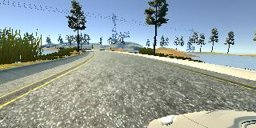
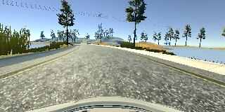
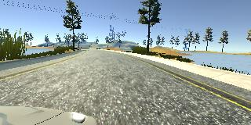
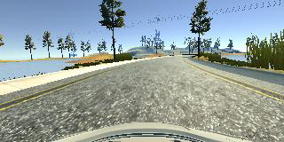

# Behaviorial Cloning Project

## Getting Started

1. Use the simulator to collect data that represents good driving behavior. The data that I used for training can be found here: [Training Data](http://seansoleyman.com/wp-content/uploads/behavioral-cloning-training-data.zip).
2. Run `model.py` to create a model.h5 file.
3. Run `drive.py model.h5` and start the simulator in autonomous mode.

[Autonomous Driving Video Link](https://youtu.be/Yde7JOIQmYY)

## Dependencies

The training dataset for this project was created using Udacity's self driving car simulator, which can be found here:

* [Linux](https://d17h27t6h515a5.cloudfront.net/topher/2017/February/58ae46bb_linux-sim/linux-sim.zip)
* [MacOS](https://d17h27t6h515a5.cloudfront.net/topher/2017/February/58ae4594_mac-sim.app/mac-sim.app.zip)
* [Windows](https://d17h27t6h515a5.cloudfront.net/topher/2017/February/58ae4419_windows-sim/windows-sim.zip)

The model.py and drive.py files have several dependencies which are listed in the environment.yml file. Here is a suggested method for satisfying these requirements:

1. Install Ubuntu 16.04.
2. Install CUDA 9.0 and CuDNN 7.0. 
3. Download and install Anaconda by running the .sh installer.
4. Create a conda environment: `conda env create --file environment.yml`
5. Activate the environment: `source activate car-simulator`

## Files In This Directory

* model.py - creates the model.h5 file using the training data.
* drive.py - generates predictions that are used to control the simulator in autonomous mode.
* video.py - generates a video from still images produced by the simulator.
* environment.yml - conda environment definition.
* model.h5 - a trained model that is ready to be used with drive.py.
* README.md - this README file.
* examples - images that are included in this README file.

## Collected Data

Several laps of training data were collected using the Udacity simulator. This data can be downloaded from here:
[Training Data](http://seansoleyman.com/wp-content/uploads/behavioral-cloning-training-data.zip)

### List of Runs

| Run # | Laps | Track | Quality   |
|:-----:|:----:|:-----:|:---------:|
| 01    | 2    | 1     | Good      |
| 02    | 2    | 1     | Fair      |
| 03    | 2    | 1     | Good      |
| 04    | 2    | 1     | Good      |
| 05    | 2    | 1     | Good      |
| 06    | 2    | 1     | Good      |
| 07    | 2    | 1     | Good      |
| 08    | 2    | 1     | Excellent |

### Quality Ratings
* Fair - Brief excursions outside the lane markings.
* Good - Stays within the lane markings at all times.
* Excellent - Well-centered for most of the time and always well within the lane markings.

### General Notes
* All runs start at the beginning of the track and end a few seconds after the final lap.
* The last couple seconds of the first three runs may not be good because the controls were released to stop recording.
* Steering was done with the arrow keys, not the mouse.

## Discussion / Writeup

### Solution Design Approach

The architecture that I used for this project is very similar to the one described by NVIDIA in [End-to-End Deep Learning for Self-Driving Cars](https://devblogs.nvidia.com/deep-learning-self-driving-cars/).

Although the original model had 4 fully connected layers, I discovered that some of these layers were unnecessary. I decided to use only 2 fully connected layers, and the model would actually work just fine with only one output layer connected directly to the final convolution.

The following techniques were used to improve performance:
* A large amount of high quality data was collected and used for training - 16 laps total.
* This dataset was augmented by flipping the images horizontally and negating the steering angles.
* Side cameras were used with a steering angle adjustment, allowing the car to recover if it went slightly off track. The steering angle adjustment factor was fine-tuned to 0.1 to prevent over-steering, while still providing fast recovery.
* Input data was normalized to the range -0.5 to 0.5.
* Top 70 pixel rows and bottom 25 pixel rows were cropped out.
* Training was stopped after just 2 epochs to prevent overfitting.

The resulting model works perfectly on Track 1. The car does not stray far from the center of the lane, and neither does it over-steer. However, a more sophisticated approach would be needed to create a model that can generalize to other un-seen tracks.

### Model Architecture

My model utilizes a convolutional neural network consisting of 5 convolutional layers and 2 fully connected layers . All of these layers (except the output layer) use ReLU activation functions.  The data is normalized and cropped using Keras layers that come right after the input.

Here is a visualization of the architecture:

| Layer         		 | Description                                  |
|:----------------------:|:--------------------------------------------:|
| Input         		 | 160x320x3 RGB image                          |
| Lambda                 | Normalize pixel values: -0.5 to 0.5          |
| Crop                   | Remove the top 70 and bottom 25 rows         |
| Convolution 5x5     	 | 2x2 stride, valid padding, outputs 78x158x24	|
| Convolution 5x5     	 | 2x2 stride, valid padding, outputs 37x77x38	|
| Convolution 5x5     	 | 2x2 stride, valid padding, outputs 17x37x46	|
| Convolution 3x3     	 | 1x1 stride, valid padding, outputs 15x35x64	|
| Convolution 3x3     	 | 1x1 stride, valid padding, outputs 13x33x64	|
| Flatten                | outputs 27456                                |
| Dense                  | outputs 10                                   |
| Dense                  | outputs 1 (no activation)                    |

#### 3. Creation of the Training Set & Training Process

I was very careful to collect high quality training data by making sure to keep the car perfectly centered throughout the entire course. I collected 8 training runs worth of data (16 laps total).

At each time-step, three images are recorded. The center image is labeled with the actual steering angle, but the left and right images are labeled with adjusted steering angles. 0.1 is added or subtracted, respectively. This trains the network to recognize when the car is going off course, and make appropriate corrections.

To augment the data set, I also flipped images and angles. Here is an image that has been flipped:

After the collection process and augmentation, I had 123894 training instances (6 instances for each of 20649 timesteps). I used scikit-learn to select 80% of these instances for training, and 20% for validation.

### Training Strategy

The model was trained using an Adam optimizer, with default parameters and batches of size 32. A generator was used to load images on the fly without having to store all of them in memory at the same time.

To prevent overfitting, training is terminated after just two epochs. The model was trained and validated on different data sets to ensure that the model was not overfitting. The model was tested by running it through the simulator and ensuring that the vehicle could stay on the track.
