# Advanced Lane Finding

The goals / steps of this project are the following:

* Compute the camera calibration matrix and distortion coefficients given a set of checkerboard images.
* Apply a distortion correction to raw images.
* Apply a perspective transform ("birds-eye view").
* Use color transforms, gradients, etc., to create a thresholded binary image.
* Detect lane pixels and fit to find the lane boundary.
* Determine the curvature of the lane and vehicle position with respect to center.
* Warp the detected lane boundaries back onto the original image.
* Output visual display of the lane boundaries and numerical estimation of lane curvature and vehicle position.

## Camera Calibration

### 1. Briefly state how you computed the camera matrix and distortion coefficients. Provide an example of a distortion corrected calibration image.

OpenCV is used to calculate camera matrix and distortion coefficients using checkerboard patterns. First, we locate all of the corners on each image using findChessboardCorners:

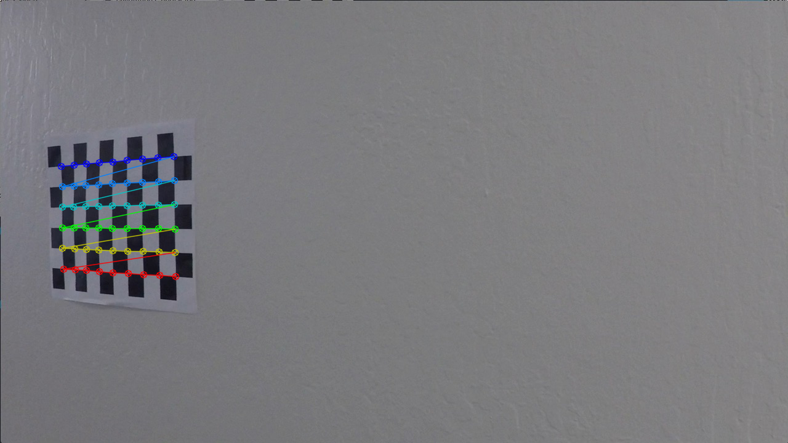

Next, we use calibrateCamera to generate a transform and undistort to apply it. Here is the result of un-distorting a close-up checkerboard image.

Original Image:
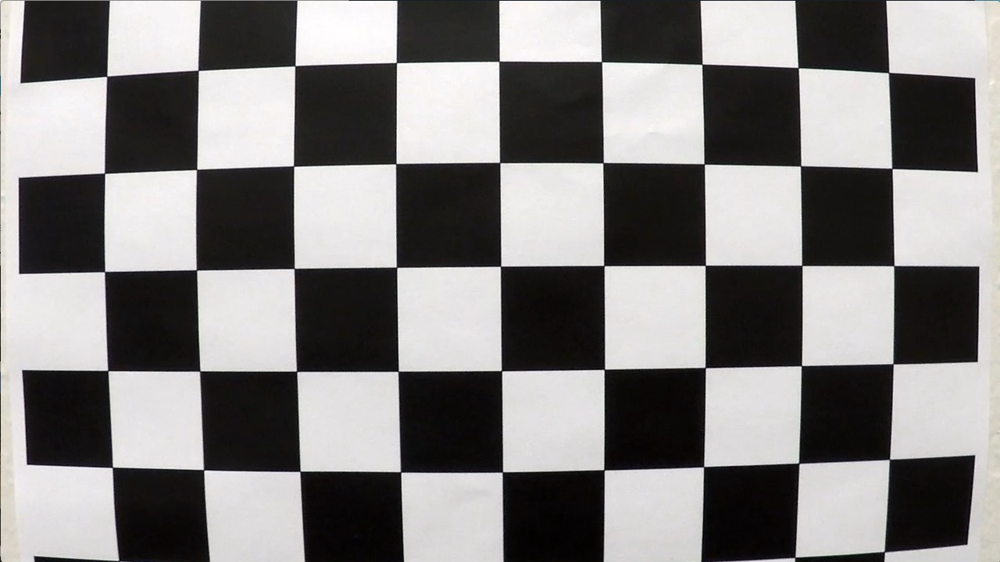

Distortion Corrected:
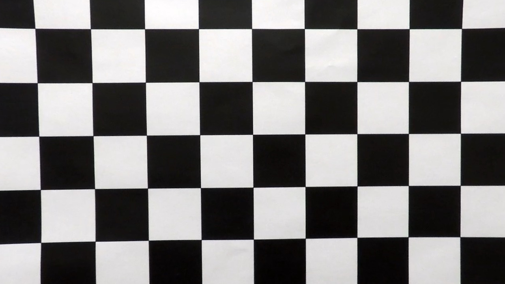

## Pipeline (single images)

### 1. Provide an example of a distortion-corrected image.

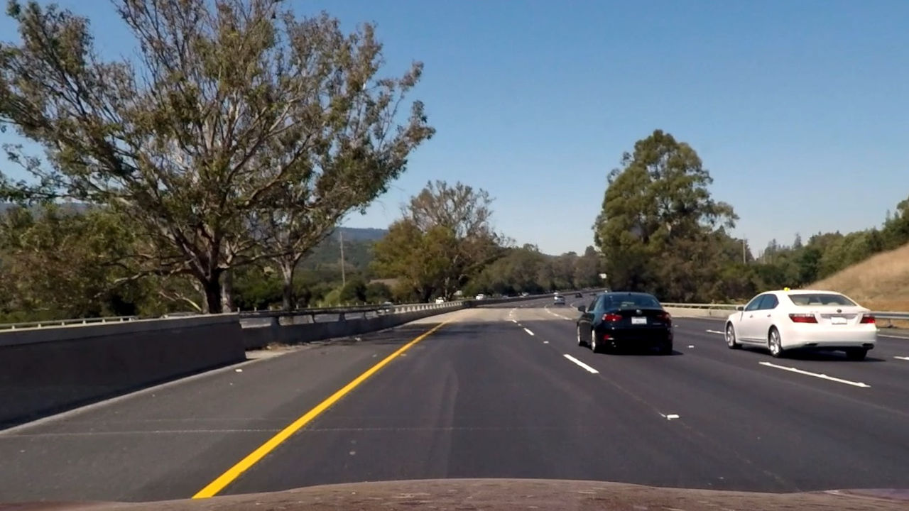

### 2. Describe how (and identify where in your code) you performed a perspective transform and provide an example of a transformed image.

I decided that the perspective transform should actually come before color transform and gradient detection. This makes it easy for the gradient detection algorithm to ignore edges that are outside the region of interest.

The following points are used to implement forward and inverse birds eye view transformations:

| Source        | Destination   |
|:-------------:|:-------------:|
| 252, 687      | 320, 720      |
| 587, 456      | 320, 0        |
| 694, 456      | 960, 0        |
| 1053, 687     | 960, 720      |

Here is an example of a transformed image:

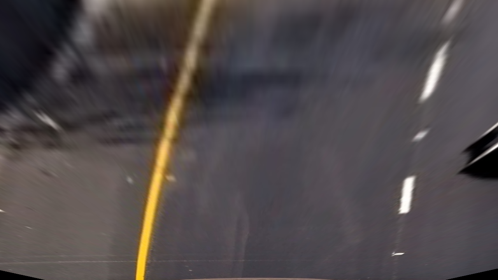

### 3. Describe how (and identify where in your code) you used color transforms, gradients or other methods to create a thresholded binary image. Provide an example of a binary image result.

The first step is to convert the image from RGB into a single-channel (grayscale) image. Since we are interested in detecting yellow and white lane lines, we should choose a color transformation that does not distinguish between yellow and white. The best way to do this is to average the red and green color channels, discarding blue:

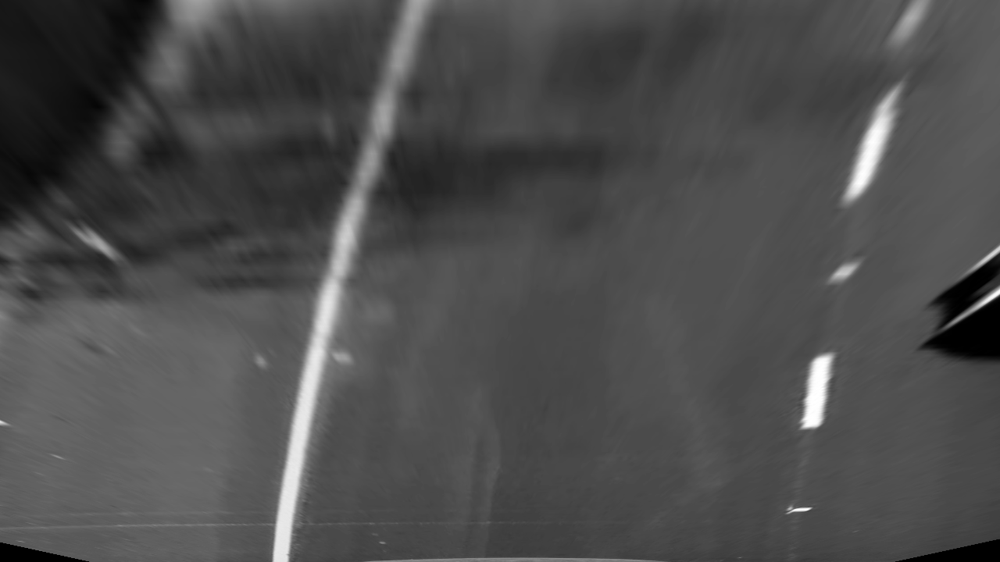

Some roads may be light gray, and others may be very dark (almost black). Also, shadows and cracks in the road may show up as gray-black transitions. We can suppress these variations by darkening the image so that the road becomes almost entirely black. This is done by subtracting the image mean and scaling the remaining brightness range to [0, 256). 

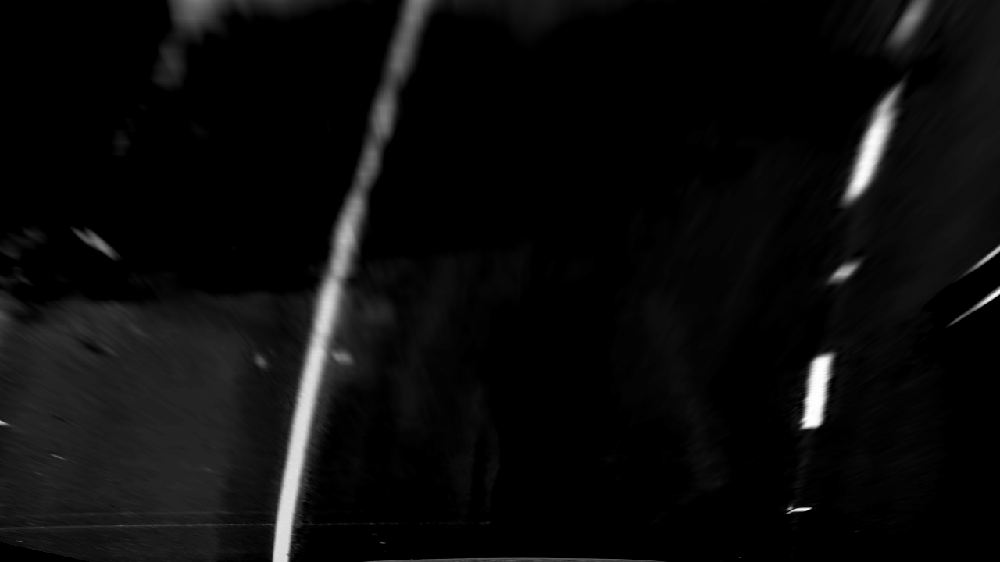

Next, we can use gamma adjustment to further suppress gray lines and enhance white lines:

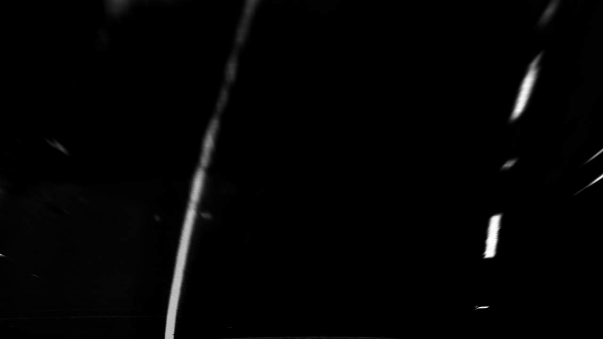

At this point, only the lane lines are visible in this image. A horizontal Sobel edge detection filter is applied to emphasize the horizontal edges and to help mitigate possible problems with white or yellow cars or other large objects on the road. The output is a binary (thresholded) image. 

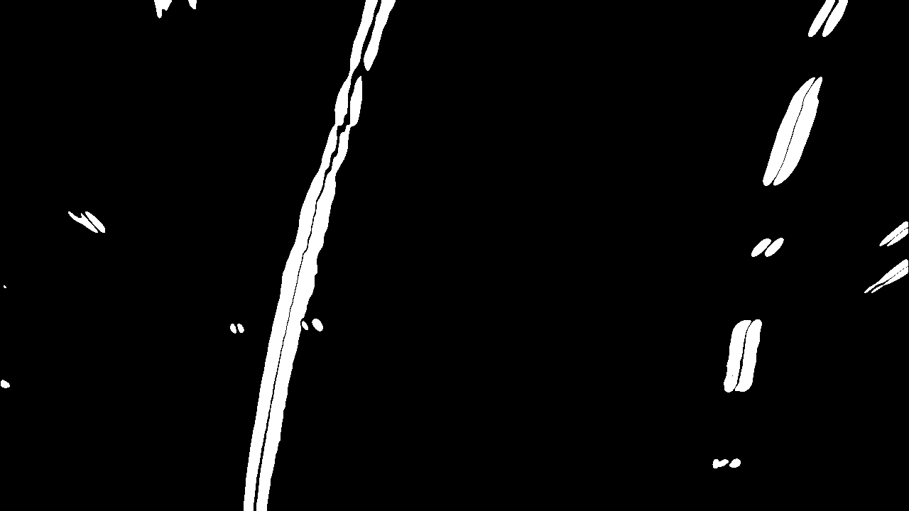

### 4. Describe how (and identify where in your code) you identified lane-line pixels and fit their positions with a polynomial?

The two lane lines are each detected using a window search. The search begins at the bottom of the image, and the starting point is limited to specific locations that correspond to the left and right sides of the vehicle. As the window moves up, it follows the lane line and marks pixels that fit inside the window. These pixels are used to fit a 2nd order polynomial to each lane line.

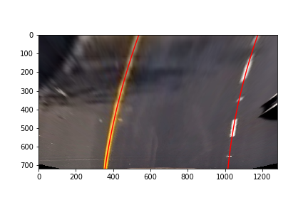

### 5. Describe how (and identify where in your code) you calculated the radius of curvature of the lane and the position of the vehicle with respect to center.

After fitting the polynomial, two functions called `curvature_from_polynomial` and `position_wrt_center` are used to determine these parameters from the polynomial coefficients. 

### 6. Provide an example image of your result plotted back down onto the road such that the lane area is identified clearly.

The inverse birds eye view transform that was computed above is used to plot the lane area over the original (camera distortion corrected) image. Also, the radius and position are printed at the top of the image using OpenCV.

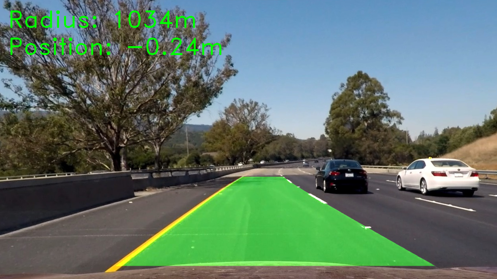

---

## Pipeline (video)

### 1. Provide a link to your final video output.  Your pipeline should perform reasonably well on the entire project video (wobbly lines are ok but no catastrophic failures that would cause the car to drive off the road!).

Here's a [link to my video result](https://youtu.be/FK5Vg8gOdOE)

---

## Discussion

### 1. Briefly discuss any problems / issues you faced in your implementation of this project.  Where will your pipeline likely fail?  What could you do to make it more robust?

This pipeline is fairly robust. It uses a color transform, darkening, and gamma adjustment to suppress any lines that are not white or yellow. It does have some difficulty with lines that have very long gaps, and with lines that fade away in the distance. It might also encounter some difficulty when driving behind a white or yellow car.

The main weakness of this algorithm is that it treats each frame independently. By using information from the previous frame, it would be possible to improve accuracy by narrowing down the lane line search to a very small horizontal area. It would also be possible to smooth the numerical results using an exponential moving average, to prevent them from jittering from frame to frame.
