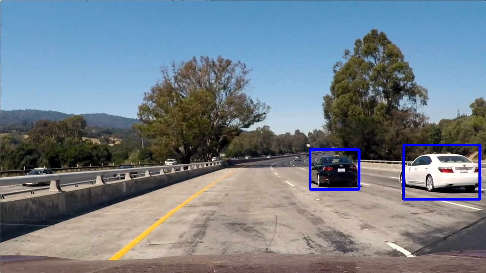

# Vehicle Detection

The goals / steps of this project are the following:

* Perform a Histogram of Oriented Gradients (HOG) feature extraction on a labeled training set of images and train a Linear SVM classifier
* Optionally, you can also apply a color transform and append binned color features, as well as histograms of color, to your HOG feature vector. 
* Note: for those first two steps don't forget to normalize your features and randomize a selection for training and testing.
* Implement a sliding-window technique and use your trained classifier to search for vehicles in images.
* Run your pipeline on a video stream (start with the test_video.mp4 and later implement on full project_video.mp4) and create a heat map of recurring detections frame by frame to reject outliers and follow detected vehicles.
* Estimate a bounding box for vehicles detected.

---

## Histogram of Oriented Gradients (HOG)

### 1. Explain how (and identify where in your code) you extracted HOG features from the training images.

The code for extracting HOG features is so indicated in the iPython notebook.

I started by reading in all the `vehicle` and `non-vehicle` images.

Here is an example from the `vehicle` class:

And one from the `non vehicle` class:

Here is an example of HOG visualization for the `vehicle` image shown above:

### 2. Explain how you settled on your final choice of HOG parameters.

I experimented with several different color spaces, and found that YUV yielded the best classifier accuracy. HOG feature extraction was performed on each of the three channels. I tried using only one of the channels, but it appears that all three contain valuable information.

Next, I tested several different sets of HOG parameters. Here are the ones that worked best:

* orient = 11
* pix_per_cell = 16
* cell_per_block = 4

I also used spatial binning and histogram binning, with the following parameters:

* spatial_size = (8, 8)
* hist_bins = 32

All of the feature vectors were concatenated and scaled before they were sent to the classifier.

### 3. Describe how (and identify where in your code) you trained a classifier using your selected HOG features (and color features if you used them).

The relevant code section is titled "SVM Classifier Training." First, I used an 80-20 train-test split to evaluate the effectiveness of chosen parameters. After settling on the parameters listed above, I re-trained the model on 100% of the available data. I also implemented horizontal flip augmentation to increase the effective size of the training set.

## Sliding Window Search

### 1. Describe how (and identify where in your code) you implemented a sliding window search.  How did you decide what scales to search and how much to overlap windows?

I used various window scales, and searched the entire area in which vehicles could appear:

The individual boxes are indiscernable because I used a very large amount of overlap: 90% for the small boxes, and 75% for the larger ones. I found that increasing the overlap enhanced the robustness of the algorithm by allowing me to use a larger threshold value.

### 2. Show some examples of test images to demonstrate how your pipeline is working.  What did you do to optimize the performance of your classifier?

After optimizing the HOG, spatial binning, and histogram binning parameters as described above, the test accuracy of the classifier is 99.21%. Unfortunately, performance on the images from the video is not as good as this number would suggest. It seems that the video is slightly brighter and more saturated than the images in the training set. 

---

## Video Implementation

### 1. Provide a link to your final video output.  Your pipeline should perform reasonably well on the entire project video (somewhat wobbly or unstable bounding boxes are ok as long as you are identifying the vehicles most of the time with minimal false positives.)
Here's a [link to my video result](./project_video_output.mp4)

### 2. Describe how (and identify where in your code) you implemented some kind of filter for false positives and some method for combining overlapping bounding boxes.

After the cropped images are classified, a heatmap is created. Scipy is used to label the image using this heatmap. Here are pictures illustrating this procedure: 

When processing the video, a large heatmap bonus is given to the area surrounding previously identified pixels in the previous frame. The bonus is calculated in make_accumulated_heatmap. 

---

## Discussion

### 1. Briefly discuss any problems / issues you faced in your implementation of this project.  Where will your pipeline likely fail?  What could you do to make it more robust?

Although the classifier works very well on a randomly sampled validation set from the training data (99.21% accuracy) it does not perform nearly as well on the actual video. Much effort is needed to suppress false positives, and it is unlikely that this approach can provide the robustness needed for practical applications. 

One possible solution would be to improve the quality of the training data by using images taken using the same camera that was used to create the video, and similar conditions. 

An even more robust solution could be created using a convolutional neural net. Here are some examples of recent research: 

[Fast R-CNN](https://arxiv.org/pdf/1504.08083.pdf)
[Faster R-CNN](https://arxiv.org/pdf/1506.01497.pdf)
[Mask R-CNN](https://arxiv.org/pdf/1703.06870.pdf)
[YOLO](https://pjreddie.com/media/files/papers/yolo.pdf)