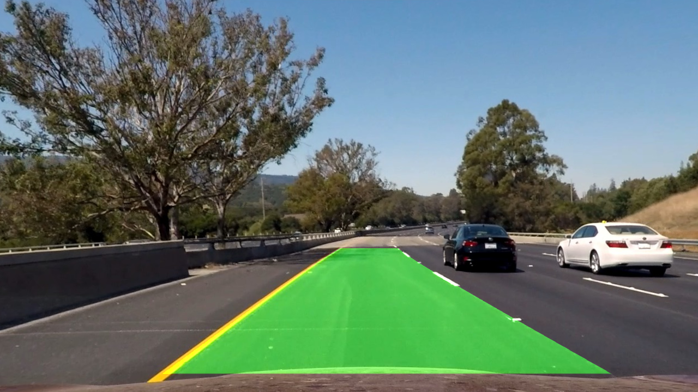

# Self-Driving Car Projects

These projects were completed as part of the Udacity Self-Driving Car Engineer online course. A summary of each project can be found in this file, and each subdirectory of this repository contains code as well as a project report.

## Project 1 - Lane Line Finder

* Uses classical computer vision algorithms to locate the left and right lane lines in images and videos taken from the front of a car.
* Implemented as a Jupyter notebook using Python 3.6.3 and OpenCV 3.3.1.

## Project 2 - Traffic Sign Classifier

* Uses a ResNet CNN to classify traffic signs with around 98% accuracy.
* Implemented as a Jupyter notebook using Python 3.6.3 and TensorFlow 1.5.

## Project 3 - Behavioral Cloning

* Training dataset was collected using Udacity's self driving car simulator.
* Next, a CNN was trained to predict good steering behavior based on the training data.
* The resulting model was used to control the car in an autonomous driving simulation.

## Project 4 - Advanced Lane Finding

* Camera calibration. 
* Color transforms, gradient detection, thresholding. 
* Perspective transformation. 
* Curve fitting, localization. 
